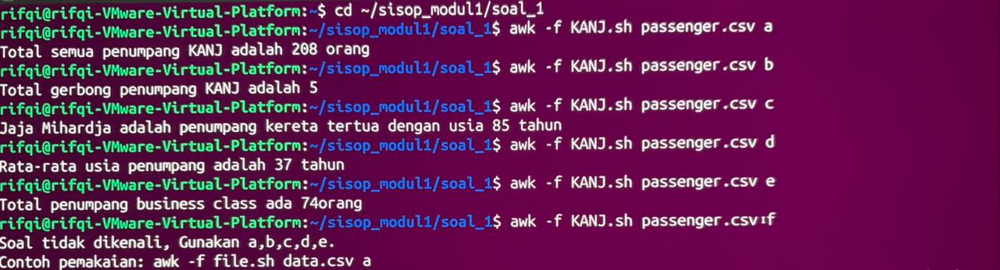
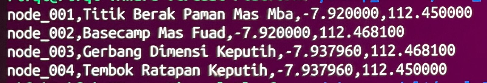
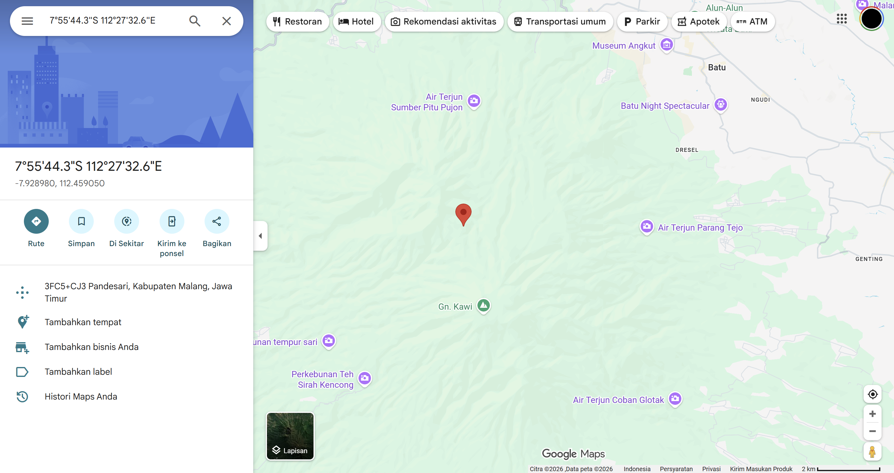

# SISOP-1-2026-IT-077

Rifqi Dwi Muslim | 5027251077

---

## Soal 1 - ARGO NGAWI JESGEJES

Soal pertama ini meminta kita untuk menganalisis data penumpang kereta KANJ dari file `passenger.csv` yang dilampirkan pada Spreadsheets dan diminta memakai `awk`. Semua perintah dimasukkan dalam 1 file `KANJ.sh` yang bisa dipanggil dengan opsi a, b, c, d, e.

Contoh cara pemanggilannya
```bash
awk -f KANJ.sh passenger.csv a
```

### Penjelasan

**Struktur kolom passenger.csv:**
```
Nama Penumpang, Usia, Kursi Kelas, Gerbong
```

`$1` = Nama Penumpang
`$2` = Usia
`$3` = Kursi Kelas
`$4` = Gerbong


**Bagian BEGIN:**
```awk
BEGIN {
    FS = ","
    opsi = ARGV[2]
    delete ARGV[2]
}
```
`FS = ","` memberitau awk pemisah kolom adalah koma, sesuai format csv.
 `ARGV[2]` saat script dipanggil dengan `awk -f KANJ.sh passenger.csv a`, awk membaca 3 hal, nama script, nama file data, dan opsi yang dipilih. Opsi `a/b/c/d/e` yang diketik di akhir tersimpan di `ARGV[2]`.
 `delete ARGV[2]` dipakai untuk menghapus opsi dari daftar argumen awk agar tidak dianggap sebagai nama file.


**Bagian NR > 1 (proses tiap baris):**
```awk
NR > 1 {
    if (opsi == "a") count++
    if (opsi == "b") gerbong[$4]++
    if (opsi == "c") {
        if ($2 > max_usia) { max_usia = $2; nama_tertua = $1 }
    }
    if (opsi == "d") { total_usia += $2; count++ }
    if (opsi == "e") { if ($3 == "Business") business++ }
}
```
`NR > 1` NR adalah nomor baris saat ini. Kondisi ini memastikan header dilewati
- **Opsi a** `count++` menambah counter setiap ada baris data, sehingga menghasilkan total penumpang
- **Opsi b** `gerbong[$4]++` menyimpan nama gerbong sebagai key array. Karena array tidak boleh duplikat, secara otomatis hanya menyimpan gerbong unik
- **Opsi c**  membandingkan `$2` (kolom usia) tiap baris dengan `max_usia`. Jika lebih besar, simpan usia dan nama penumpang tersebut
- **Opsi d** `total_usia += $2` menjumlahkan semua usia, `count++` menghitung jumlah penumpang untuk pembagi rata rata
- **Opsi e** cek apakah kolom `$3` bernilai "Business", kalau iya tambah counter `business`


**Bagian END (cetak hasil):**
```awk
END {
    if (opsi == "a") print "Jumlah seluruh penumpang KANJ adalah " count " orang"
    else if (opsi == "b") print "Jumlah gerbong penumpang KANJ adalah " length(gerbong)
    else if (opsi == "c") print nama_tertua " adalah penumpang kereta tertua dengan usia " max_usia " tahun"
    else if (opsi == "d") print "Rata-rata usia penumpang adalah " int(total_usia/count) " tahun"
    else if (opsi == "e") print "Jumlah penumpang business class ada " business " orang"
    else {
        print "Soal tidak dikenali. Gunakan a, b, c, d, atau e."
        print "Contoh penggunaan: awk -f file.sh data.csv a"
    }
}
```
Blok `END` dijalankan sekali setelah semua baris selesai dibaca.
 `length(gerbong)`untuk  menghitung jumlah key yang ada di array gerbong, yaitu jumlah gerbong unik.
 `int(total_usia/count)` `int()` untuk membulatkan hasil bagi ke bawah tanpa angka di belakang koma.
 `else` digunakan untuk menampilkan pesan error jika opsi yang dimasukkan bukan a,b,c,d,e.

### Output

Screenshot hasil menjalankan kelima opsi a-e dan opsi lain 



### Kendala

Tidak ada kendala

---

## Soal 2 - EKSPEDISI PESUGIHAN GUNUNG KAWI

Untuk soal ini alurnya mengunduh peta ekspedisi dari GDrive, lalu membaca isinya untuk menemukan link tersembunyi pada PDF, melakukan git clone dari link tersebut, mengekstrak koordinat dari file JSON dan menghitung titik tengahnya.

### Penjelasan

**1. Download PDF menggunakan gdown**

Sebelum menggunakan gdown, dibuat virtual environment terlebih dahulu agar instalasi package tidak mengganggu sistem
```bash
python3 -m venv myenv
source myenv/bin/activate
pip install gdown
```
`python3 -m venv myenv` membuat Python terisolasi bernama `myenv`.
kemudian `source myenv/bin/activate` mengaktifkan virtual environment.
 `pip install gdown` menginstall tool gdwon di dalam virtual environment

File PDF diunduh dengan
```bash
gdown 1q10pHSC3KFfvEiCN3V6PTroPR7YGHF6Q -O peta-ekspedisi-amba.pdf
```
`gdown`untuk mendownload file dari Gdrive
dan `-O` menentukan nama file output


**2. Menemukan link dari dalam PDF**

Dari hasil perintah gdwon ditemukan link github di paling bawah isinya, lalu clone
```bash
git clone https://github.com/pocongcyber77/peta-gunung-kawi.git peta-gunung-kawi
```

**3. parserkoordinat.sh**

Script ini untuk mengekstrak `id`, `site_name`, `latitude`, dan `longitude` dari `gsxtrack.json`:

```bash
#!/bin/bash

ids=$(grep '"id"' gsxtrack.json | grep "node_" | sed 's/.*"id": "\(.*\)".*/\1/')
names=$(grep '"site_name"' gsxtrack.json | sed 's/.*"site_name": "\(.*\)".*/\1/')
lats=$(grep '"latitude"' gsxtrack.json | sed 's/.*"latitude": \(.*\),/\1/')
lons=$(grep '"longitude"' gsxtrack.json | sed 's/.*"longitude": \(.*\),/\1/')

paste -d',' <(echo "$ids") <(echo "$names") <(echo "$lats") <(echo "$lons") > titik-penting.txt
```
- `grep '"id"'` mencari semua baris yang mengandung kata `"id"` dari file JSON
- `grep "node_"` memfilter lebih lanjut, hanya mengambil baris yang mengandung `node_` agar tidak ikut baris lain yang kebetulan ada kata "id"
- `sed 's/.*"id": "\(.*\)".*/\1/'` mengambil nilai antara tanda kutip setelah `"id": `. Bagian `\(.*\)` menangkap nilai itu, dan `\1` memanggilnya kembali
- `paste -d','` menggabungkan beberapa input menjadi 1 baris dengan pemisah koma
- `<(echo "$ids")` mengubah output variabel menjadi input yang bisa dibaca `paste`
- `> titik-penting.txt`menyimpan hasil ke file

Screenshot isi titik-penting.txt




**4. nemupusaka.sh**

Script untuk menghitung titik tengah diagonal dari 4 koordinat yang ada di `titik-penting.txt`:

```bash
#!/bin/bash

baris1=$(head -1 titik-penting.txt)
baris2=$(head -2 titik-penting.txt | tail -1)
baris3=$(head -3 titik-penting.txt | tail -1)
baris4=$(head -4 titik-penting.txt | tail -1)

lat1=$(echo "$baris1" | cut -d',' -f3)
lon1=$(echo "$baris1" | cut -d',' -f4)
lat3=$(echo "$baris3" | cut -d',' -f3)
lon3=$(echo "$baris3" | cut -d',' -f4)

lat_tengah=$(echo "scale=6; ($lat1 + $lat3) / 2" | bc)
lon_tengah=$(echo "scale=6; ($lon1 + $lon3) / 2" | bc)

echo "$lat_tengah,$lon_tengah" > posisipusaka.txt
cat posisipusaka.txt
```
- `head -1` mengambil baris pertama dari file,
- `head -2 | tail -1` mengambil 2 baris pertama lalu ambil yang terakhir, hasilnya baris kedua.
- `cut -d',' -f3` memotong teks berdasarkan pemisah koma (`-d','`), ambil kolom 3 (`-f3`) yaitu latitude
- `echo "scale=6; ($lat1 + $lat3) / 2" | bc` menghitung rata rata pakai `bc`. `scale=6` menentukan 6 angka di belakang koma

Titik tengah dihitung dari node_001 dan node_003 karena keduanya adalah titik diagonal yang berseberangan

*Diperoleh Koordinat Pusat: -7.928980,112.459050*

Screenshot verifikasi di Google Maps:



### Kendala

Tidak ada kendala


# Soal 3 - Kost Slebew Ambatukam
Soal ini meminta untuk membuat program manajemen kost berbasis CLI interaktif menggunakan Bash script dan AWK. Program harus memiliki menu yang terus berjalan sampai user memilih Exit, dengan fitur fitur yang telah saya selesaikan sebagai berikut

1. Tambah Penghuni Baru
2. Hapus Penghuni
3. Tampilkan Daftar Penghuni
4. Exit Program

---

## Penjelasan Pengerjaan

### Inisialisasi

Di awal script, kita buat semua folder dan file yang dibutuhkan kalau belum ada. Ini penting supaya script tidak error waktu pertama kali dijalankan.

```bash
mkdir -p data sampah log rekap

if [ ! -f "$DATA_FILE" ]; then
    echo "nama,kamar,harga_sewa,tanggal_masuk,status" > "$DATA_FILE"
fi
```

---

### Opsi 1 - Tambah Penghuni Baru

Fungsi ini meminta input dari user secara interaktif, lalu melakukan beberapa validasi sebelum menyimpan data ke `penghuni.csv`.

**Validasi yang dilakukan:**
- Nomor kamar tidak boleh sama dengan yang sudah ada (unik)
- Harga sewa harus angka positif
- Format tanggal harus YYYY-MM-DD
- Tanggal tidak boleh melebihi hari ini
- Status hanya boleh `Aktif` atau `Menunggak`

Untuk cek kamar unik, kita pakai AWK untuk scan seluruh CSV:

```bash
if awk -F',' -v k="$kamar" 'NR > 1 { if ($2 == k) found=1 } END { exit !found }' "$DATA_FILE"; then
    echo "[X] Kamar sudah ditempati!"
fi
```

Kalau semua validasi lolos, data langsung di append ke CSV:

```bash
echo "$nama,$kamar,$harga,$tanggal,$status" >> "$DATA_FILE"
```

---

### Opsi 2 - Hapus Penghuni

Penghuni tidak langsung dihapus begitu saja. Datanya dipindahkan dulu ke `sampah/history_hapus.csv` dengan tambahan kolom tanggal penghapusan, baru setelah itu dihapus dari database utama.

```bash
# Arsipkan ke history dulu
awk -F',' -v n="$nama" -v d="$today" \
    'NR > 1 && $1 == n { print $0","d }' "$DATA_FILE" >> "$HISTORY_FILE"

# Baru hapus dari database utama
awk -F',' -v n="$nama" \
    'NR == 1 || $1 != n { print }' "$DATA_FILE" > /tmp/temp.csv
mv /tmp/temp.csv "$DATA_FILE"
```

Kenapa pakai file temp (`/tmp/temp.csv`)? Karena kita tidak bisa baca dan tulis file yang sama secara bersamaan di AWK, jadi kita tulis ke file sementara dulu, lalu replace file aslinya.

---

### Opsi 3 - Tampilkan Daftar Penghuni

Menggunakan AWK untuk memformat data CSV menjadi tabel yang rapi di terminal, lengkap dengan summary total penghuni, jumlah aktif, dan jumlah menunggak.

```bash
awk -F',' '
NR > 1 {
    count++
    printf "%-4s| %-20s| %-6s| %-15s| %s\n", count, $1, $2, "Rp"$3, $5
}
' "$DATA_FILE"
```

`printf` dengan format `%-Ns` dipakai supaya kolom-kolomnya rata kiri dan lebarnya konsisten.

---

## Cara Menjalankan

```bash
# Beri izin eksekusi
chmod +x kost_slebew.sh

# Jalankan
./kost_slebew.sh
```

---

## Kendala yang Ditemui

Sempat bingung soal kenapa harus pakai file temp waktu delete/update data di CSV. Ternyata AWK tidak bisa sekaligus baca dan overwrite file yang sama, jadi solusinya tulis ke `/tmp/` dulu baru di-`mv`.

Selain itu, validasi tanggal cukup tricky karena harus pastikan format-nya benar dan tidak melebihi tanggal hari ini. Akhirnya pakai kombinasi regex untuk cek format, dan string comparison untuk cek apakah tanggal melebihi hari ini.
